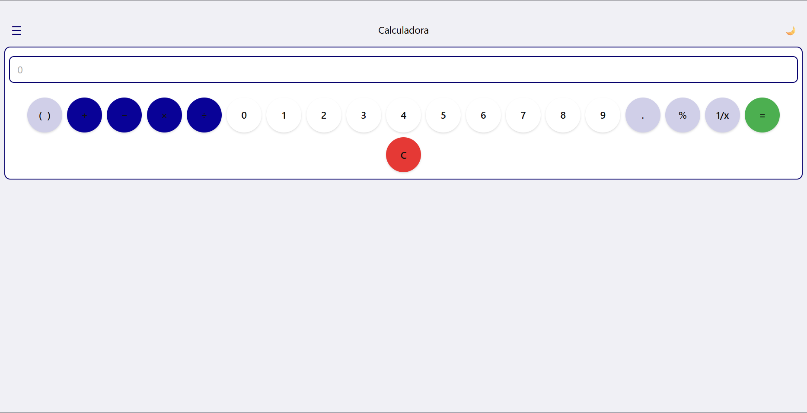
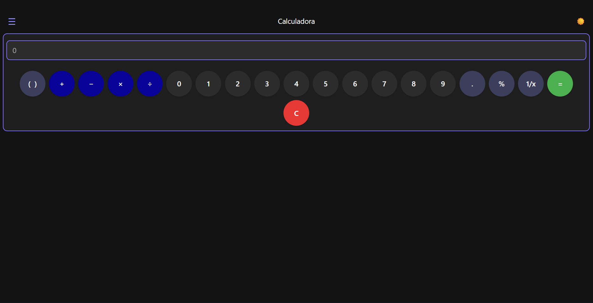
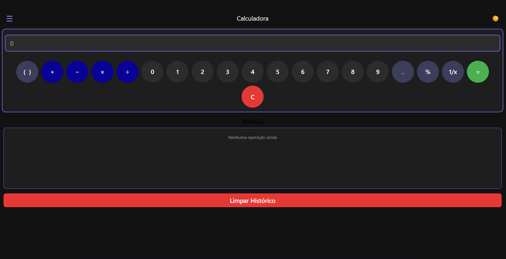

#  Calculadora React Native

Uma calculadora moderna e intuitiva desenvolvida em React Native com suporte a operações matemáticas básicas e histórico de cálculos.

##  Descrição

Esta é uma aplicação de calculadora criada como atividade acadêmica, oferecendo uma experiência de usuário fluida com interface responsiva e suporte a temas claro e escuro.

##  Funcionalidades

- Operações matemáticas básicas
  - Soma (+)
  - Subtração (-)
  - Multiplicação (×)
  - Divisão (÷)
- Entrada via teclado numérico ou digitação manual
- Histórico de cálculos
- Temas claro e escuro
- Interface responsiva

## 📸 Screenshots

### Tema Claro



### Tema Escuro



### Histórico de Cálculos



## 🚀 Como Usar

### Instalação

Certifique-se de ter o Node.js instalado em sua máquina.

```bash
# Clone ou acesse o diretório do projeto
cd app01

# Instale as dependências
npm install
```

### Executando a Aplicação

```bash
# Inicie o servidor Expo
npm start

# Para Android
npm run android

# Para iOS
npm run ios

# Para Web
npm run web
```

## 🎮 Modo de Uso

1. **Digitando a expressão**: Paulo escrever diretamente na barra de entrada a expressão matemática completa
2. **Usando os botões**: Clique nos botões numéricos e operadores para construir sua expressão
3. **Visualizando histórico**: Acesse o histórico para ver todos os cálculos realizados
4. **Alternando temas**: Troque entre os temas claro e escuro conforme sua preferência

## 🛠️ Tecnologias

- **React Native** - Framework para desenvolvimento mobile
- **Expo** - Plataforma para desenvolvimento React Native
- **TypeScript** - Tipagem estática para JavaScript
- **React Navigation** - Navegação entre telas
